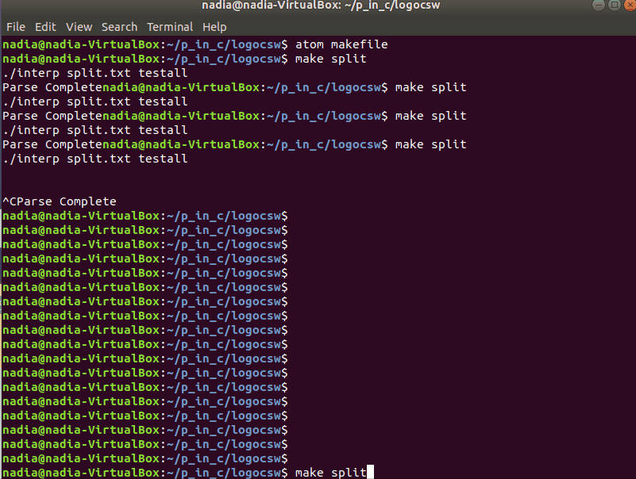

A parser and interpreter of the simple language LOGO was created for this project. The main files that contain the bulk of the application are:
parse.c
interp.c

The below gif shows a binary tree being created using C's SDL libary. This was a syntax I added to the language (SPLIT), which is based from the logic of a binary search tree.

